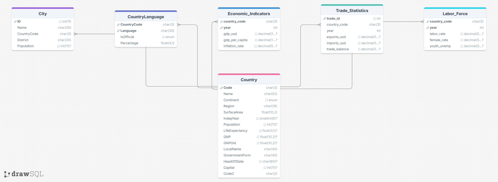

# CPSC 332 — Database Design Project
## Group 5 | World DB Extension: Economic Indicators

---

## 👥 Group Members
- Alexia Arroyo Tellez
- Andrew Davalos
- Nathan Smith
- Nithin Rajesh

---

## 📋 Project Overview

This project extends the existing **World Database** by adding three new tables focused on **Economic Indicators** for 22 countries across 6 continents. All data was sourced from the **World Bank Open Data** platform for the year **2020**.

The goal was to design a relational database schema, populate it with real-world data, and write meaningful SQL queries to analyze global economic trends including GDP, trade statistics, and labor force participation.

---

## 🌍 Countries Covered

Our data spans **22 countries** across **6 continents**:

| Continent | Countries |
|---|---|
| North America | USA, CAN, MEX |
| South America | BRA, ARG, COL |
| Europe | GBR, DEU, FRA, TUR |
| Asia | CHN, JPN, IND, SAU, KOR, IDN |
| Africa | NGA, ZAF, EGY, KEN |
| Oceania | AUS, NZL |

---

## 🗄️ New Tables Added

### 1. Economic_Indicators
Tracks GDP and inflation data per country per year.

| Column | Type | Description |
|---|---|---|
| country_code (PK, FK) | CHAR(3) | References Country(Code) |
| year (PK) | INT | Year of record |
| gdp_usd | DECIMAL(20,2) | GDP in US dollars |
| gdp_per_capita | DECIMAL(10,2) | GDP per capita in US dollars |
| inflation_rate | DECIMAL(5,2) | Annual inflation rate (%) |

### 2. Trade_Statistics
Tracks exports, imports and trade balance per country per year.

| Column | Type | Description |
|---|---|---|
| trade_id (PK) | INT AUTO_INCREMENT | Unique trade record ID |
| country_code (FK) | CHAR(3) | References Country(Code) |
| year | INT | Year of record |
| exports_usd | DECIMAL(20,2) | Total exports in US dollars |
| imports_usd | DECIMAL(20,2) | Total imports in US dollars |
| trade_balance | DECIMAL(20,2) | Exports minus imports |

### 3. Labor_Force
Tracks labor force participation rates per country per year.

| Column | Type | Description |
|---|---|---|
| country_code (PK, FK) | CHAR(3) | References Country(Code) |
| year (PK) | INT | Year of record |
| labor_rate | DECIMAL(5,2) | Overall labor participation rate (%) |
| female_rate | DECIMAL(5,2) | Female labor participation rate (%) |
| youth_unemp | DECIMAL(5,2) | Youth unemployment rate (%) |

---

## 📊 ER Diagram


---

## 🗂️ Relational Schema



> Both diagrams are also available combined in `diagrams_group5.pdf`

---

## 📁 File Structure

```
database-design/
│
├── create_tables_group5.sql     # Creates all 6 tables in world_group5 database
├── insert_data_group5.sql       # Populates all tables with World DB + new data
├── queries_group5.sql           # 12 SQL queries across 4 categories
├── diagrams_group5.pdf          # ER Diagram + Relational Schema combined
├── Final_ER_Diagram_drawio.png  # ER Diagram image
├── drawSQL-image-export-2026-03-31.jpg  # Relational Schema image
└── README.md                    # Project documentation
```

---

## ▶️ How to Run

Run the files **in this order** in MySQL Workbench:

1. **`create_tables_group5.sql`** — Creates the `world_group5` database and all 6 tables
2. **`insert_data_group5.sql`** — Inserts all Country, City, CountryLanguage and new table data
3. **`queries_group5.sql`** — Runs all 12 analytical queries

> ⚠️ Do not run `insert_data_group5.sql` more than once — it will cause duplicate entry errors on tables with composite primary keys.

---

## 🔍 Queries Summary

| Query | Category | Description |
|---|---|---|
| Q1 | JOIN | Country name, continent, GDP and inflation rate |
| Q2 | JOIN | Country name, exports, imports and trade balance |
| Q3 | JOIN | Country name, labor rate and youth unemployment |
| Q4 | OUTER JOIN | All countries with or without economic data |
| Q5 | EXISTS | Countries with both economic and trade data |
| Q6 | IN | Countries with a trade surplus |
| Q7 | Correlated | Countries with above average GDP per capita |
| Q8 | AGGREGATION | Average GDP and inflation grouped by continent |
| Q9 | AGGREGATION | Total exports and imports grouped by continent |
| Q10 | HAVING | Continents where average youth unemployment exceeds 15% |
| Q11 | RANKING | Top 10 countries by GDP |
| Q12 | RANKING | Countries ranked by trade balance surplus to deficit |

---

## 📦 Data Source

All economic data was sourced from **[World Bank Open Data](https://data.worldbank.org/)** for the year **2020**.
